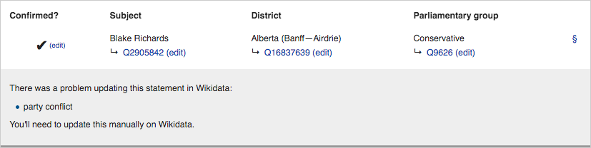

# Verification Pages Documentation

## Introduction:
The Verification Pages tool has been developed my [mySociety](https://www.mysociety.org/) was part of the [Democratic Commons/ EveryPolitician](https://www.wikidata.org/wiki/Wikidata:WikiProject_every_politician) project [funded](https://meta.wikimedia.org/wiki/Grants:Project/mySociety/EveryPolitician) by the Wikimedia Foundation.

The aim of the project is to allow users to check data from an online source, reconcile it to Wikidata IDs, and add a reference URL before bringing data into Wikidata.

The tool has the potential to make it substantially easier for community members to add data themselves and to maintain existing data – it provides a practical balance between individual manual and bulk data entry.

## Source code:
This project is open source; the code can be found at:
- [Verification Pages](https://github.com/mysociety/verification-pages) is the main repository for running the backend Ruby application and for compiling the frontend JS
- [Membership Comparison](https://github.com/everypolitician/membership-comparison), the backend application delegates to this Ruby gem, which has the main logic to determine if a statement can be created/ updated or if there is a conflict.

## Application architecture

### Frontend
The frontend is a Vue JS application compiled using Webpack into a single file that includes all JavaScript, HTML and CSS required to run. Having everything on a single page means it can be embedded into a Wiki page and users can install it in their `common.js` feature of Mediawiki.

### Installing the Verification Pages JS
You should add the following import script to your [common.js](htttps://www.wikidata.org/Special:MyPage/common.js).

```js
importScript('User:Verification_pages_bot/verification.js');
```

This will initialise the Vue JS application when visiting a Verification Page.

### Backend
The backend is a Ruby on Ruby application with a JSON API to allow the frontend to retrieve up-to-date statements. This is deployed on the Wikimedia's Toolforge platform, details are on [Wikitech](https://wikitech.wikimedia.org/wiki/Tool:Verification_pages).

## Data source
The tool uses a data source CSV to get suggestions on to a Verification Page. The rows in the CSV should be suggestions of what positions people hold. these require certain headings to be accepted as a valid suggestion

### Columns

Column | Aliases | Type | Required
-------|---------|------|---------
`person_name` | `name` | string | true
`person_item` | `wikidata`,<br>`id` | Wikidata ID | false
`electoral_district_name` | `area`,<br>`constituency`,<br>`district` | string | true
`electoral_district_item` | `area_id`, `area_wikidata`, `wikidata_area`,<br>`constituency_id`, `constituency_wikidata`, `wikidata_constituency`,<br>`district_id`, `district_wikidata`, `wikidata_district` | Wikidata ID | false
`parliamentary_group_name` | `alliance`,<br>`coalition`,<br>`faction`,<br>`party`,<br>`group` | string | true
`parliamentary_group_item` | `alliance_id`, `alliance_wikidata`, `wikidata_alliance`,<br>`coalition_id`, `coalition_wikidata`, `wikidata_coalition`,<br>`faction_id`, `faction_wikidata`, `wikidata_faction`,<br>`party_id`, `party_wikidata`, `wikidata_party`,<br>`group_id`, `group_wikidata`, `wikidata_group` | Wikidata ID | false
`position_start` | `start_date` | date | false
`position_end` | `end_date` | date | false

### Examples
There are many existing CSV sources from the EveryPolitician project: EG:

* https://github.com/everypolitician/everypolitician-data/blob/master/data/Canada/Commons/term-42.csv
* https://github.com/everypolitician/everypolitician-data/blob/master/data/Brazil/Deputies/term-55.csv

### Updates to the CSV
The data source CSV will be regularly fetched, parsed and Wiki pages updated to ensure pages are always with up-to-date with the current state of the statements. This is useful as the statements might change from 3rd party changes made directly to the Wikidata items instead of a verification page.

## Creating a new verification page
New verification pages can be created on Wikidata using the [Verification_page](https://www.wikidata.org/wiki/Template:Verification_page) Wiki template.
We would suggest creating these pages within your User sandbox and to subscribe to them so you are notified of updates when the data source changes.

### Example

```wiki
{{Verification_page
|position_held_item=Q56235896
|parliamentary_term_item=Q56235901
|csv_source_url=https://gist.githubusercontent.com/tmtmtmtm/578e899afe5724f14958ee4909361351/raw/anguilla-2015.csv
|csv_source_language=en
|new_item_description_en=politician in Anguilla
|new_party_description_en=political party in Anguilla
|new_party_instance_of_item=Q7278
|new_district_description_en=constituency in Anguilla
|new_district_instance_of_item=Q192611
}}
```

### Template parameters

* `position_held_item` (required): Wikidata item representing a position held. This will be added to Wikidata items as a [P39](https://www.wikidata.org/wiki/Property:P39) statement
* `parliamentary_term_item` (optional): Wikidata item representing a parliamentary term. This will be added to [P39](https://www.wikidata.org/wiki/Property:P39) statements as a [P2937](https://www.wikidata.org/wiki/Property:P2937) qualifier
* `csv_source_url` (required): CSV data source with suggestions for new [P39](https://www.wikidata.org/wiki/Property:P39) statements
* `csv_source_language` (required): Label language code for new Wikidata items
* `new_item_description_en` (required): Description to be added to new Wikidata items
* `new_party_description_en` (required): Description to be added to new political party Wikidata items
* `new_party_instance_of_item` (required): Wikidata item representing what the political party is an instance of. This will be added to any created political party Wikidata items as a [P31](https://www.wikidata.org/wiki/Property:P31) statement
* `new_district_description_en` (required): Description to be added to new electoral district Wikidata items
* `new_district_instance_of_item` (required): Wikidata item representing what the electoral district is an instance of. This will be added to any created electoral districts Wikidata items as a [P31](https://www.wikidata.org/wiki/Property:P31) statement

Note there isn't a `new_item_instance_of_item` parameter as we're assuming any person created with be a human.

Once a template is being used a "Set up page" button should be visible on the page.

## Setting up a verification page
Clicking the "Set up page" button will link the page with the Ruby backend application, as part of this the data source will be fetched and parsed.
The application will query Wikidata query service to check for any existing statements and then update the Wiki page with statements classified based on when actions are required. More on this in the next section.

## Using the frontend application
There are 4 main stages of the application. Statement verification, reconciliation, actioning, conflict resolution. The application automatically progresses from one stage to the next for each statement.

We have produced a short screencast which shows the tool in action: https://www.youtube.com/watch?v=2KlRc1L6WMs

### Verifying
The statement verification step is a required step for each statement, this is for the user to check the statement are correct against a 3rd party reference URL. This URL where possible should be sourced from an official government webpage and should verify all the statement's suggested data, included the electoral district and political party if these are included in the source data.


When adding or changing a reference you'll be presented with an option to use the same URL for all the other statements on the same verification page. This is useful if the reference page is a index page showing all the current holders of the position being dealt with. Sometimes this isn't available and you will need to added a reference URL for each statement individually.


The reference URL and the date verified will be added as an reference source to the Wikidata statement.

It's possible to to correct any mistakes you can edit the verification by clicking "edit" in the "Confirmed?" column.

### Reconcile
Reconciliation is only required if the data source doesn't include Wikidata IDs for the person, electoral district and political party. If any or these are missing then you'll need to reconcile these properties so the tool can correctly associate them as qualifiers to the [P39](https://www.wikidata.org/wiki/Property:P39).


The first step is to search existing items on Wikidata and Wikipedia in the source language for the item. If a match is found then clicking the "Use this" button will update the statement to the relevant ID.


If a match isn't found then you can change language and correct the search term. This allows you to correct minor mistakes in the source data. For example grammatical or spelling errors.

If a match still can't be found then its possible to create a new item by clicking the "Create new item" button at the bottom of the search results. This will use the description and instance of item values defined in the Wiki template when setting up the page.

Once you've chosen an item to reconcile against you may be presented with the option to reconcile other suggestions on the same verification page too. This will allow you to update multiple suggestions at once and especially useful for the political parties and electoral districts where multiple politician can belong to the same party or district. If there are any statements which have already been reconciled to a different Wikidata item you'll also be alerted to investigate.


To correct any reconciliation mistakes you can edit the reconciliation by clicking "edit" next to the relevant Wikidata ID.

### Actioning
Once all the fields have been reconciled the statement is automatically added to Wikidata if certain conditions are met. These conditions are discussed in the '[How do we decide if a statement can be actioned?](#how-do-we-decide-if-a-statement-can-be-actioned)' section of this guide.


When a statement is actioned the tool makes multiple API requests to Wikidata to setup the [P39](https://www.wikidata.org/wiki/Property:P39) statement and its qualifiers and references.

Occasionally there might be issue (EG network issues) where an API request has fail. In this case you'll see a "Submit to Wikidata" button and clicking this re-runs the actioning step.


### Conflicts
Sometime a suggestion can't be actioned due to conditions set out in the '[How do we decide if a statement can be actioned?](#how-do-we-decide-if-a-statement-can-be-actioned)' section. In these cases you should manually update the existing statements to ensure there is no conflict.



### Statement changes made outside of Verification Pages
If there are changes made to the statement outside of the original verification page then this will be detected so the suggestion can't be re-run and remove potential more up-to-date information.

Nb: This sometimes shows a lag between the SPARQL query service and what has been recently been submitted to Wikidata.


## How do we decide if a statement can be actioned?
The logic behind determining if a statement can be created or not exists in the [Membership Comparison](https://github.com/everypolitician/membership-comparison) gem. There are a number of things we look out for to workout if a statement can be actioned, or is a conflict. A statement can be actioned if its is a new statement which doesn't clash with existing data or when it's adding data to an partially matching existing statement.

When comparing existing statements we compare the start and end dates of the parliamentary terms. A politician could have many similar statements for multiple different terms or different statements for the same term when they've changed political parties during the term. Also sometimes there may be an existing statement for and different `position_held` item which needs considering as it could be either the superclass or subclass of the `position_held` set-up on the verification page.

We also check to see if there are existing statements for a similar position EG. 'Member of Parliament of the United Kingdom' or 'Member of the 57th Parliament of the United Kingom'. These term specific statements are used for some countries and we need to ensure we aren't creating duplicate statements if there is a superclass or a superclass position held already existing.

All of these conditions are taking into account and we determine if the statement is correct, wrong, if it needs updating or if its new and can be added.